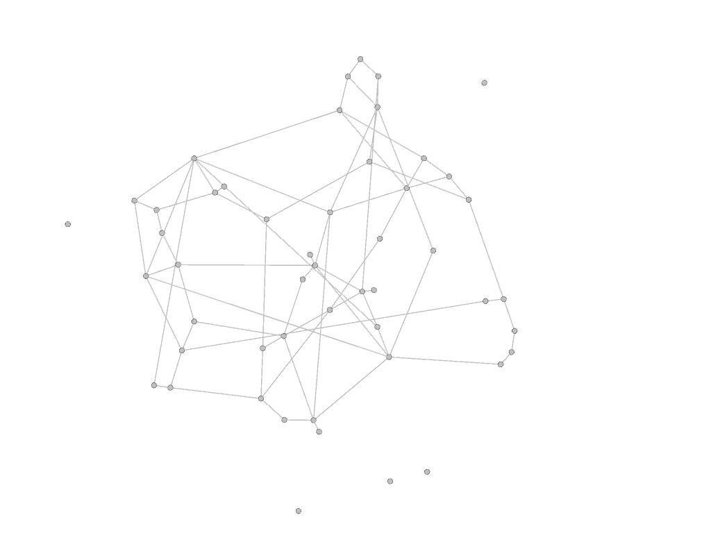
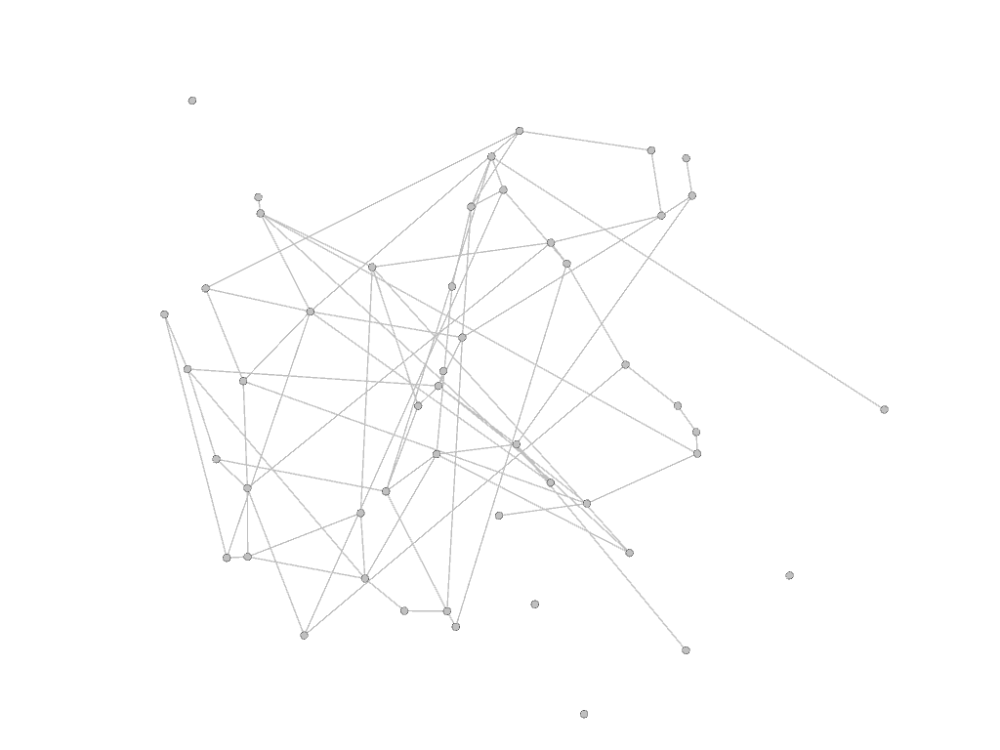
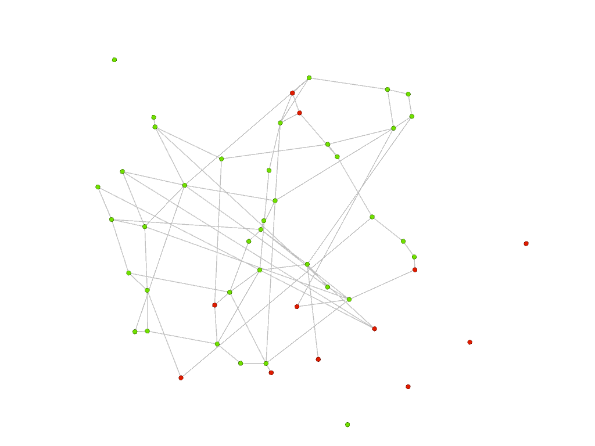
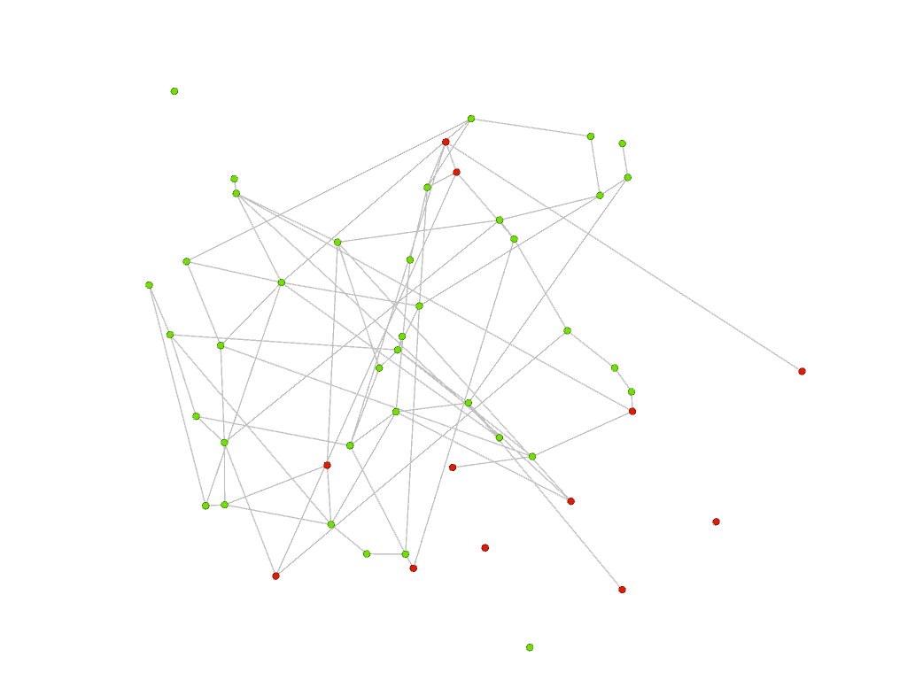
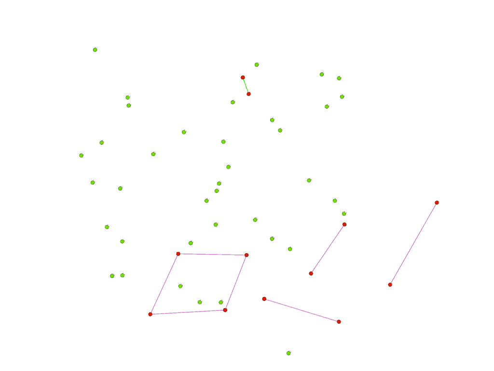
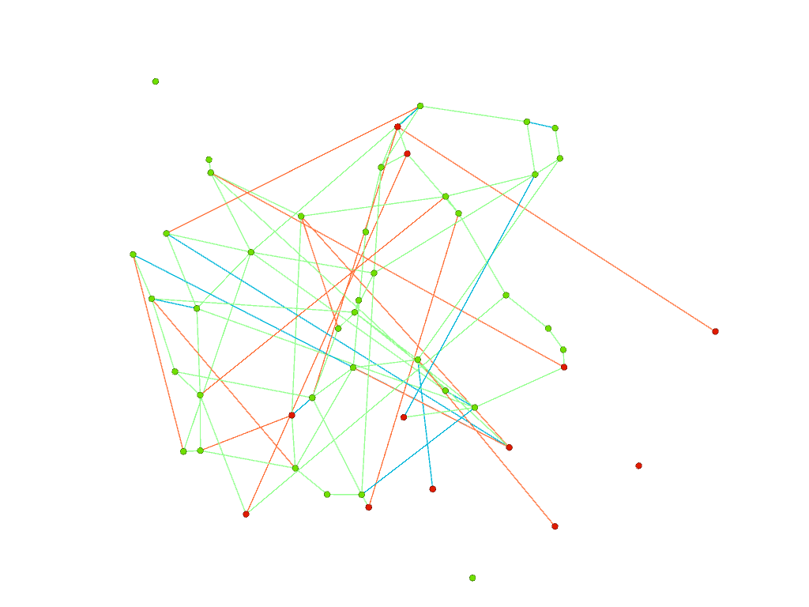
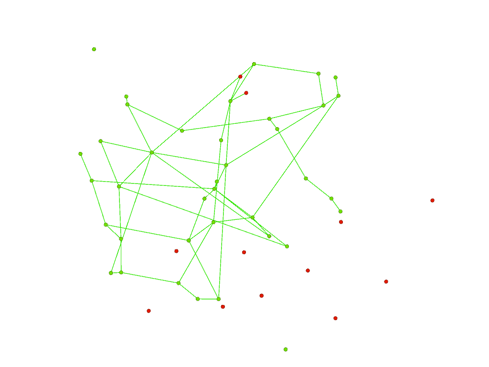
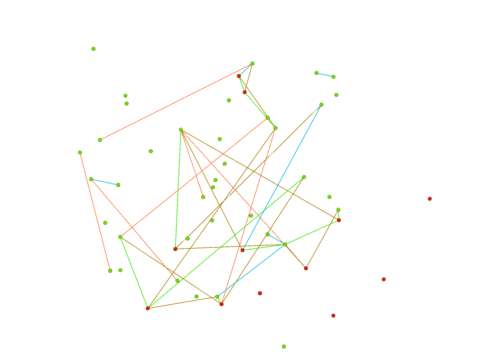
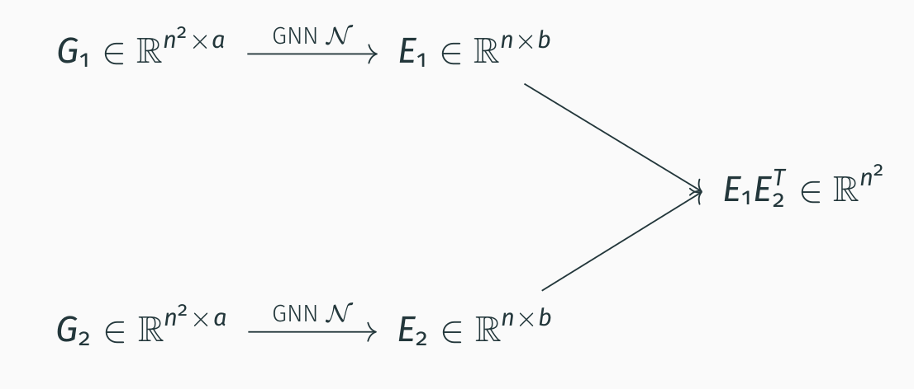
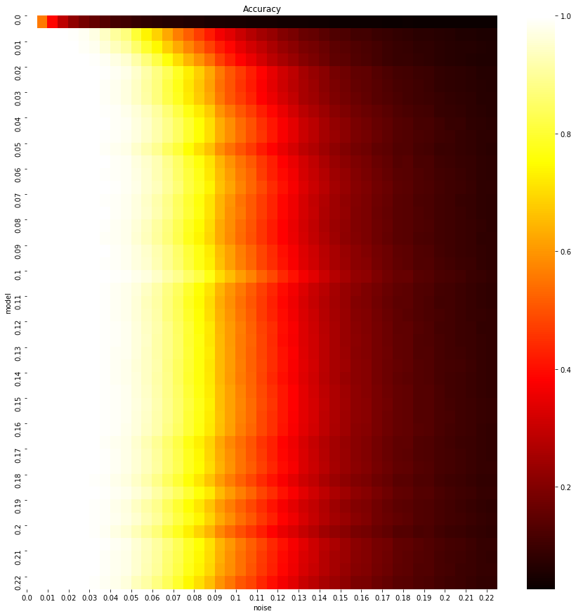

# Expressive Power of Invariant and Equivaraint Graph Neural Networks 

In this repository, we show how to use powerful GNN (2-FGNN) to solve a  graph alignment problem. This code was used to derive the practical results in the following paper:

Waiss Azizian, Marc Lelarge. Expressive Power of Invariant and Equivariant Graph Neural Networks, ICLR 2021.

[arXiv](https://arxiv.org/abs/2006.15646) [OpenReview](https://openreview.net/forum?id=lxHgXYN4bwl) 
## Problem: alignment of graphs
The graph isomorphism problem is the computational problem of determining whether two finite graphs are isomorphic. Here we consider a noisy version of this problem: the two graphs below are noisy versions of a parent graph. There is no strict isomorphism between them. Can we still match the vertices of graph 1 with the corresponding vertices of graph 2?

graph 1 | graph 2
:---:|:---:
 | 

With our GNN, we obtain the following results: green vertices are well paired vertices and red vertices are errors. Both graphs are now represented using the layout from the right above but the color of the vertices are the same on both sides. At inference, our GNN builds node embedding for the vertices of graphs 1 and 2. Finally a node of graph 1 is matched to its most similar node of graph 2 in this embedding space.

graph 1 | graph 2
:---:|:---:
 | 

Below, on the left, we plot the errors made by our GNN: errors made on red vertices are represented by links corresponding to a wrong matching or cycle; on the right, we superpose the two graphs: green edges are in both graphs (they correspond to the parent graph), orange edges are in graph 1 only and blue edges are in graph 2 only. We clearly see the impact of the noisy edges (orange and blue) as each red vertex (corresponding to an error) is connected to such edges (except the isolated red vertex).

Wrong matchings/cycles | Superposing the 2 graphs
:---:|:---:
 | 

To measure the performance of our GNN, instead of looking at vertices, we can look at edges. On the left below, we see that our GNN recovers most of the green edges present in graphs 1 and 2 (edges from the parent graph). On the right, mismatched edges correspond mostly to noisy (orange and blue) edges (present in only one of the graphs 1 or 2). 

Matched edges | Mismatched edges
:---:|:---:
 | 

## Training GNN for the graph alignment problem

For the training of our GNN, we generate synthetic datasets as follows: first sample the parent graph and then add edges to construct graphs 1 and 2. We obtain a dataset made of pairs of graphs for which we know the true matching of vertices. We then use a siamese encoder as shown below where the same GNN (i.e. shared weights) is used for both graphs. The node embeddings constructed for each graph are then used to predict the corresponding permutation index by taking the outer product and a softmax along each row. The GNN is trained with a standard cross-entropy loss.
At inference, we can add a LAP solver to get a permutation from the matrix .



Various architectures can be used for the GNN and we find that FGNN (first introduced by Maron et al. in [Provably Powerful Graph Networks](https://papers.nips.cc/paper/2019/hash/bb04af0f7ecaee4aae62035497da1387-Abstract.html) NeurIPS 2019) are best performing for our task. In our paper [Expressive Power of Invariant and Equivariant Graph Neural Networks](https://openreview.net/forum?id=lxHgXYN4bwl), we substantiate these empirical findings by **proving that FGNN has a better power of approximation among all equivariant architectures working with tensors of order 2 presented so far** (this includes message passing GNN or linear GNN).

## Results



Each line corresponds to a model trained at a given noise level and shows
its accuracy across all noise levels. We see that pretrained models generalize very well at noise levels unseen during the training.

We refer to our [paper](https://openreview.net/forum?id=lxHgXYN4bwl) for comparison with other algorithms (message passing GNN, spectral or SDP algorithms).

To cite our paper:
```
@inproceedings{azizian2020characterizing,
  title={Expressive power of invariant and equivariant graph neural networks},
  author={Azizian, Wa{\"\i}ss and Lelarge, Marc},
  booktitle={International Conference on Learning Representations},
  year={2021},
  url={https://openreview.net/forum?id=lxHgXYN4bwl}
}
```

## Overview of the code
### Project structure

```bash
.
├── loaders
|   └── dataset selector
|   └── data_generator.py # generating random graphs
|   └── test_data_generator.py
|   └── siamese_loader.py # loading pairs 
├── models
|   └── architecture selector
|   └── layers.py # equivariant block
|   └── base_model.py # powerful GNN Graph -> Graph
|   └── siamese_net.py # GNN to match graphs
├── toolbox
|   └── optimizer and losses selectors
|   └── logger.py  # keeping track of most results during training
|   └── metrics.py # computing scores
|   └── losses.py  # computing losses
|   └── optimizer.py # optimizers
|   └── utility.py
|   └── maskedtensor.py # Tensor-like class to handle batches of graphs of different sizes
├── commander.py # main file from the project serving for calling all necessary functions for training and testing
├── trainer.py # pipelines for training and validation
├── eval.py # testing models
```


## Dependencies
Dependencies are listed in `requirements.txt`. To install, run
```
pip install -r requirements.txt
```
## Training 
Run the main file ```commander.py``` with the command ```train```
```
python train commander.py
```
To change options, use [Sacred](https://github.com/IDSIA/sacred) command-line interface and see ```default.yaml``` for the configuration structure. For instance,
```
python commander.py train with cpu=No data.generative_model=Regular train.epoch=10 
```
You can also copy ```default.yaml``` and modify the configuration parameters there. Loading the configuration in ```other.yaml``` (or ```other.json```) can be done with
```
python commander.py train with other.yaml
```
See [Sacred documentation](http://sacred.readthedocs.org/) for an exhaustive reference. 

To save logs to [Neptune](https://neptune.ai/), you need to provide your own API key via the dedicated environment variable.

The model is regularly saved in the folder `runs`.

## Evaluating

There are two ways of evaluating the models. If you juste ran the training with a configuration ```conf.yaml```, you can simply do,
```
python commander.py eval with conf.yaml
```
You can omit ```with conf.yaml``` if you are using the default configuartion.

If you downloaded a model with a config file from here, you can edit the section ```test_data``` of this config if you wish and then run,
```
python commander.py eval with /path/to/config model_path=/path/to/model.pth.tar
```
